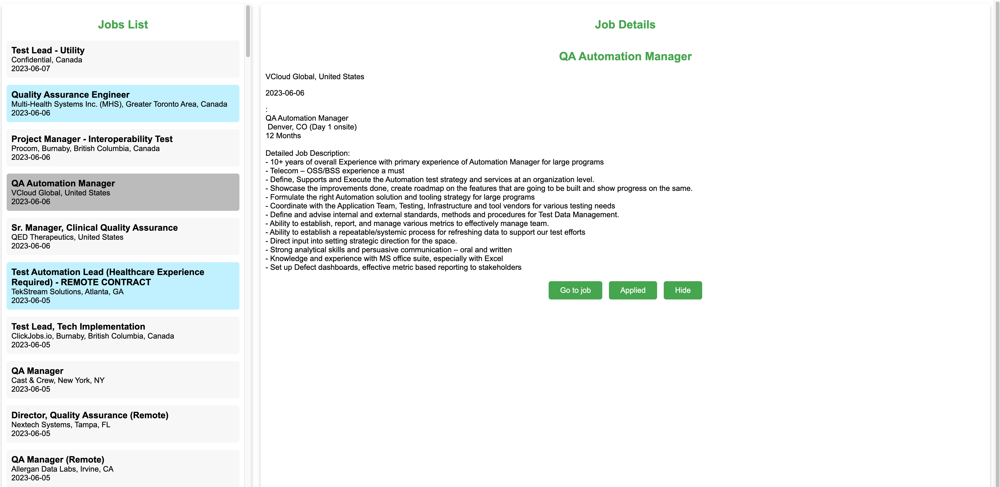

# README.md

## LinkedIn Job Scraper

This is a Python application that scrapes job postings from LinkedIn and stores them in a SQLite database. The application also provides a web interface to view the job postings and mark them as applied or hidden.


### IMPORTANT NOTE

If you are using this application, please be aware that LinkedIn does not allow scraping of its website. Use this application at your own risk. It's recommended to use proxy servers to avoid getting blocked by LinkedIn (more on proxy servers below).

### Prerequisites

- Python 3.6 or higher
- Flask
- Requests
- BeautifulSoup
- Pandas
- SQLite3

### Installation

1. Clone the repository to your local machine.
2. Install the required packages using pip: `pip install -r requirements.txt`
3. Create a `config.json` file in the root directory of the project. See the `config.json` section below for details on the configuration options.
4. Run the application using the command `python app.py`.
5. Open a web browser and navigate to `http://localhost:5000` to view the job postings.

### Usage

The application consists of two main components: the scraper and the web interface.

#### Scraper

The scraper is implemented in `main.py`. It scrapes job postings from LinkedIn based on the search queries and filters specified in the `config.json` file. The scraper removes duplicate and irrelevant job postings based on the specified keywords and stores the remaining job postings in a SQLite database.

To run the scraper, execute the following command:

```
python main.py
```

#### Web Interface

The web interface is implemented using Flask in `app.py`. It provides a simple interface to view the job postings stored in the SQLite database. Users can mark job postings as applied or hidden, and the changes will be saved in the database.

When the job is marked as "applied" it will be highlighted in light blue so that it's obvious at a glance which jobs are applied to. Upon clicking "Hide" the job will dissappear from the list. There's currently no functionality to unhide or un-apply. To reverse it you'd have to go to the database and change values in applied and hidden columns.

To run the web interface, execute the following command:

```
python app.py
```

Then, open a web browser and navigate to `http://localhost:5000` to view the job postings.

### Configuration

The `config.json` file contains the configuration options for the scraper and the web interface. Below is a description of each option:

- `proxies`: The proxy settings for the requests library. Set the `http` and `https` keys with the appropriate proxy URLs.
- `headers`: The headers to be sent with the requests. Set the `User-Agent` key with a valid user agent string. If you don't know your user agen, google "my user agent" and it will show it.
- `search_queries`: An array of search query objects, each containing the following keys:
  - `keywords`: The keywords to search for in the job title.
  - `location`: The location to search for jobs.
  - `f_WT`: The job type filter. Values are as follows:
        -  0 - onsite
        -  1 - hybrid
        -  2 - remote
        -  empty (no value) - any one of the above.
- `desc_words`: An array of keywords to filter out job postings based on their description.
- `title_only`: boolean (true/false) value that controls how job filtering is done:
  -  true: ONLY jobs that have at least one of the words from 'title_words' in its title will be considered, the rest will be discarded
  -  false: jobs that have ANY of the word from 'title_words' will be discarded, the rest will be scraped.
- `title_words`: An array of keywords to filter job postings based on their title and based on 'title_only' value.
- `timespan`: The time range for the job postings. "r604800" for the past week, "r84600" for the last 24 hours. Basically "r" plus 60 * 60 * 24 * <number of days>.
- `jobs_tablename`: The name of the table in the SQLite database where the job postings will be stored.
- `filtered_jobs_tablename`: The name of the table in the SQLite database where the filtered job postings will be stored.
- `db_path`: The path to the SQLite database file.
- `pages_to_scrape`: The number of pages to scrape for each search query.

### Contributing

Pull requests are welcome. For major changes, please open an issue first to discuss what you would like to change.

### License

This project is licensed under the MIT License.X
Write README.md file for this project. Make it detailed as possible.
X
